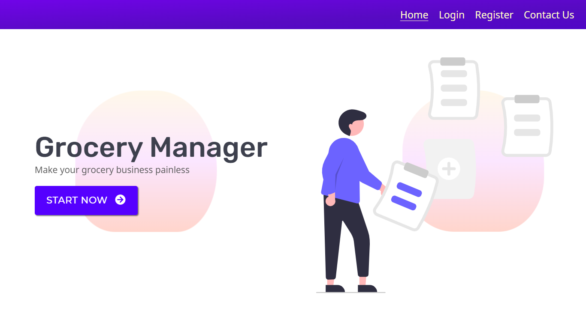

# [Grocery-manager](https://grocerymanager.pythonanywhere.com)



It is a flask web application where you can manage your 🏪 business like adding new products, managing new orders etc.

## How To Use

To use the application you need to create an account on the application & then login and now you can use the services provided by the application.
**Link** - [https://grocerymanager.pythonanywhere.com](https://grocerymanager.pythonanywhere.com)

## For Developers

If anyone is interested in running the code in local maching then follow the below mentioned steps:-

### Step-1 :-

Clone the git repo locally in your machine

```bash
$ git clone https://github.com/Rahulbaran/grocery-manager.git
```

### Step-2 :-

Create a **virtual environment** in the project folder(root) in your machine (_python3.9_ is recommended)

##### Windows

```bash
> python -m venv virtual
```

##### macOS/Linux

```bash
$ python3 -m venv virtual
```

### Step-3 :-

Activate the created virtual environment

##### Windows

If you are using command prompt

```bash
> virtual/scripts/activate.bat
```

If you are using git bash terminal

```bash
$ . virtual/scripts/activate
```

##### macOS/Linux

```bash
$ source virtual/bin/activate
```

### Step-4 :-

Install all the python packages using `requirements.txt` file provided in the repo.

```bash
(virtual)$ pip install -r requirements.txt
```

If Some packages did not install then try to install them individually (In my case I had to install `wheel` separately).

### Step-5 :-

Create a `.env` file in **root** directory (folder) and put the following inputs (in capital) in the file which will be used in **app configuration**.

<<<<<<< HEAD
| INPUT NAME |
|-------------|
| SECRET_KEY |
| RECAPTCHA_PRIVATE_KEY (You will have to register your application in Google Recaptcha website to get private & public keys)|
| RECAPTCHA_PUBLIC_KEY |
| GMAIL_USERNAME |
| GMAIL_PASSWORD (You will have to generate it using google account) |
| ADMIN_USERNAME (Use any username and password you wish for admin page) |
| ADMIN_PASSWORD |
| ACCOUNT_SID (To use the admin page you will have to go through 2FA & I am using Twilio for OTP) |
| AUTH_TOKEN |
| TWILIO_PHONE_NUMBER |
| PERSONAL_MOBILE_NUMBER (Provide any mobile number you wish to get the OTP for 2FA) |
=======
| INPUT NAME                                                                                                                  |
| --------------------------------------------------------------------------------------------------------------------------- |
| SECRET_KEY                                                                                                                  |
| RECAPTCHA_PRIVATE_KEY (You will have to register your application in Google Recaptcha website to get private & public keys) |
| RECAPTCHA_PUBLIC_KEY                                                                                                        |
| GMAIL_USERNAME                                                                                                              |
| GMAIL_PASSWORD (You will have to generate it using google account)                                                          |
| ADMIN_USERNAME (Use any username and password you wish for admin page)                                                      |
| ADMIN_PASSWORD                                                                                                              |
| ACCOUNT_SID (To use the admin page you will have to go through 2FA & I am using Twilio for OTP)                             |
| AUTH_TOKEN                                                                                                                  |
| TWILIO_PHONE_NUMBER                                                                                                         |
| PERSONAL_MOBILE_NUMBER (Provide any mobile number you wish to get the OTP for 2FA)                                          |
>>>>>>> 2ce3fb8d7c6ad47da43049bddeaaa7d53a2e20c9

### Step-6 :-

Create a directory (folder) `Databases` in `grocery` folder of your root directory.

```bash
(virtual)$ cd grocery
(virtual)$ mkdir Databases
```

### Step-7 :-

Set the following configuration in your CLI (Command Line Interface)

##### Windows

```bash
(virtual)> set FLASK_APP=run && set FLASK_ENV=development
```

##### macOS/Linux

```bash
(virtual)$ export FLASK_APP=run && export FLASK_ENV=development
```

### Step-8 :-

Open Python Interpreter and create `sqlite` database as shown below

```bash
>>> from grocery import create_app, db
>>> with create_app().app_context():
        db.create_all()
```

A `sqlite` database file of name `dev.db` will be created in `Databases` folder.
If You are interested in using `MYSQL` as database then You will have to add configuration required for `MYSQL` in your `.env` file

```bash
MYSQL_DB_URI='mysql+pymysql://<username>:<password>@localhost/grocery'
```

Now create the database using the same command , you have used for `sqlite` database.

### Step-9 :-

Now Run your application

```bash
$ flask run
```

Congrats, You did it🙂🎉
